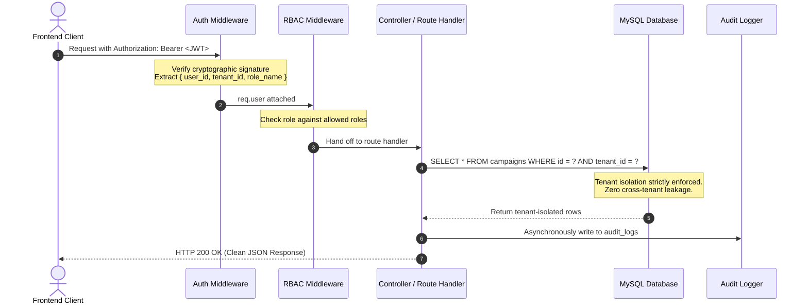
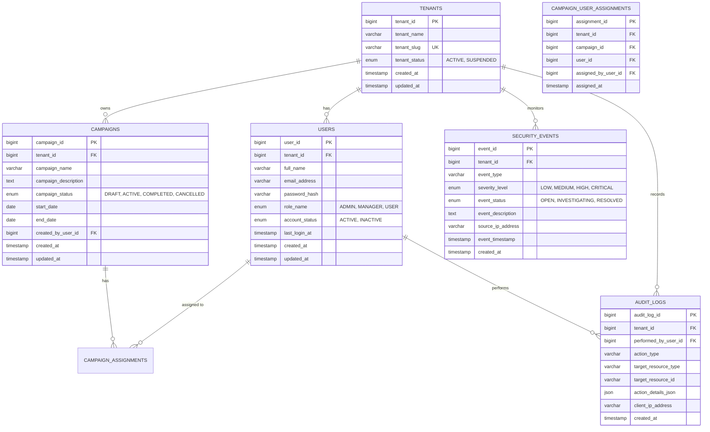
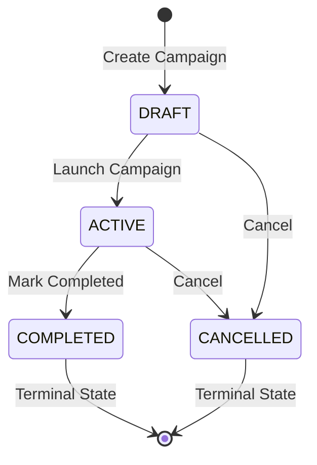

# Deep Trace Cybernetics — Multi-Tenant Security Platform

> **Full Stack Developer Technical Assessment Submission**  
> **Stack:** Node.js / Express.js • React 19 / Vite • MySQL 8.0 • Tailwind CSS • JWT • RBAC   

---

## Executive Summary

The **Multi-Tenant Security Platform** is an enterprise-grade cybersecurity operations hub designed to manage security campaigns, triage real-time security events, and maintain an immutable compliance audit trail across multiple distinct client organizations (tenants).

The architecture is engineered around two non-negotiable principles:
1. **Zero-Trust Multi-Tenancy**: The application never trusts client-supplied tenant identifiers or roles. All authorization and tenant boundaries are cryptographically derived from the verified JWT payload.
2. **Backend-Enforced Role-Based Access Control (RBAC)**: Fine-grained permissions are strictly validated at the API layer across three distinct tiers: `ADMIN`, `MANAGER`, and `USER`.

---

## Table of Contents
1. [Architecture & Multi-Tenant Design](#1-architecture--multi-tenant-design)
2. [Database Schema & ERD](#2-database-schema--erd)
3. [RBAC Permissions Matrix](#3-rbac-permissions-matrix)
4. [Campaign State Machine](#4-campaign-state-machine)
5. [Complete REST API Specification](#5-complete-rest-api-specification)
6. [Mandatory Security Scenario Proof](#6-mandatory-security-scenario-proof)
7. [Step-by-Step Installation & Run Guide](#7-step-by-step-installation--run-guide)
8. [Automated Security Verification Suite (`npm test`)](#8-automated-security-verification-suite-npm-test)
9. [Pre-Seeded Demo Accounts](#9-pre-seeded-demo-accounts)
10. [Engineering Assessment Questions (In-Depth)](#10-engineering-assessment-questions-in-depth)
11. [Project Structure](#11-project-structure)

---

## 1. Architecture & Multi-Tenant Design

### Data Isolation Strategy: Pooled Database with Row-Level Tenant Scoping
The platform implements a **Shared Database, Shared Schema** architecture utilizing indexed `tenant_id` partitioning across every table:



### Zero-Trust Tenancy Principles
- **No Client Spoofing**: Any `tenant_id` or `role` sent in headers, query parameters, or request bodies is discarded.
- **404 Over 403 on Foreign Resources**: If a user belonging to **Tenant A** requests a resource owned by **Tenant B** (e.g. `GET /api/campaigns/201`), the backend returns `404 Not Found` rather than `403 Forbidden`. This prevents attackers from enumerating the existence of resources in other organizations.

---

## 2. Database Schema & ERD

The database schema is defined in [database/schema.sql](file:///c:/Users/pavan/OneDrive/Documents/multi-tenant-app/multi-tenant-security-platform/database/schema.sql) with comprehensive constraints, cascading foreign keys, and composite indexes.



### Table & Column Details
1. **`tenants`**: Root multi-tenant accounts (`tenant_id`, `tenant_name`, `tenant_slug`, `tenant_status`).
2. **`users`**: User records scoped to a tenant (`user_id`, `tenant_id`, `full_name`, `email_address`, `password_hash`, `role_name`, `account_status`, `last_login_at`). Unique key on `(tenant_id, email_address)`.
3. **`campaigns`**: Security campaigns scoped by tenant (`campaign_id`, `tenant_id`, `campaign_name`, `campaign_description`, `campaign_status`, `start_date`, `end_date`, `created_by_user_id`).
4. **`campaign_user_assignments`**: Maps assigned tenant members to campaigns with tenant integrity (`assignment_id`, `tenant_id`, `campaign_id`, `user_id`, `assigned_by_user_id`). Unique on `(campaign_id, user_id)`.
5. **`security_events`**: Real-time threats (`event_id`, `tenant_id`, `event_type`, `severity_level`, `event_status`, `event_description`, `source_ip_address`, `event_timestamp`).
6. **`audit_logs`**: Immutable audit ledger (`audit_log_id`, `tenant_id`, `performed_by_user_id`, `action_type`, `target_resource_type`, `target_resource_id`, `action_details_json`, `client_ip_address`).

---

## 3. RBAC Permissions Matrix

The platform strictly differentiates access across three hierarchical roles:

| Module / Action | `ADMIN` | `MANAGER` | `USER` |
|---|:---:|:---:|:---:|
| **Login & Profile View** | ✅ | ✅ | ✅ |
| **View Tenant Dashboard Metrics** | ✅ | ✅ | ✅ |
| **List & View Campaigns** | ✅ | ✅ | ✅ |
| **Create Security Campaigns** | ✅ | ✅ | ❌ *(403 Forbidden)* |
| **Update Campaign & Status Transitions** | ✅ | ✅ | ❌ *(403 Forbidden)* |
| **Assign / Remove Users on Campaigns** | ✅ | ✅ | ❌ *(403 Forbidden)* |
| **Delete Campaigns** | ✅ | ❌ *(403 Forbidden)* | ❌ *(403 Forbidden)* |
| **View Security Incidents** | ✅ | ✅ | ✅ |
| **Triage Incident Status (`OPEN` $\rightarrow$ `RESOLVED`)** | ✅ | ✅ | ❌ *(403 Forbidden)* |
| **View Compliance Audit Logs** | ✅ | ✅ | ❌ *(403 Forbidden)* |
| **View Team Directory** | ✅ | ✅ | ✅ |
| **Register New Organization Members** | ✅ | ❌ *(403 Forbidden)* | ❌ *(403 Forbidden)* |

---

## 4. Campaign State Machine

Campaign lifecycles follow a strict state transition model. Any illegal state change is rejected by the backend with `400 Bad Request`.



- **Valid Transitions**:
  - `DRAFT` $\rightarrow$ `ACTIVE` or `CANCELLED`
  - `ACTIVE` $\rightarrow$ `COMPLETED` or `CANCELLED`
- **Enforced Rules**:
  - A campaign in `COMPLETED` or `CANCELLED` cannot transition to any other status.
  - An `ACTIVE` campaign cannot be reverted back to `DRAFT`.

---

## 5. Complete REST API Specification

All protected endpoints require an `Authorization: Bearer <token>` header.

### Authentication Endpoints (`/api/auth`)
| Method | Endpoint | Access | Description |
|---|---|---|---|
| `POST` | `/api/auth/login` | Public | Authenticates credentials, writes `USER_LOGIN` audit log, returns JWT token + user profile. |
| `GET` | `/api/auth/me` | Authenticated | Returns current authenticated user and organization info. |

### Campaign Endpoints (`/api/campaigns`)
| Method | Endpoint | Access | Description |
|---|---|---|---|
| `GET` | `/api/campaigns` | All Roles | Lists campaigns with search (`?search=`), status filter (`?status=`), and pagination (`?page=1&limit=10`). |
| `GET` | `/api/campaigns/:id` | All Roles | Retrieves campaign details + assigned user roster. Returns `404` if owned by another tenant. |
| `POST` | `/api/campaigns` | `ADMIN`, `MANAGER` | Creates a new campaign (starts as `DRAFT`). Records audit log. |
| `PUT` | `/api/campaigns/:id` | `ADMIN`, `MANAGER` | Updates campaign details and validates status state machine. Records audit log. |
| `DELETE` | `/api/campaigns/:id` | `ADMIN` only | Deletes campaign and cascades assignments. Records audit log. |
| `POST` | `/api/campaigns/:id/assignments` | `ADMIN`, `MANAGER` | Assigns user to campaign (strictly checks user belongs to same tenant). |
| `DELETE` | `/api/campaigns/:id/assignments/:userId` | `ADMIN`, `MANAGER` | Removes assigned user from campaign. |

### Security Events Endpoints (`/api/events`)
| Method | Endpoint | Access | Description |
|---|---|---|---|
| `GET` | `/api/events` | All Roles | Lists tenant incidents with filters (`?severity=`, `?status=`, `?search=`) and pagination. |
| `PATCH` | `/api/events/:id/status` | `ADMIN`, `MANAGER` | Updates triage state (`OPEN` $\rightarrow$ `INVESTIGATING` $\rightarrow$ `RESOLVED`). Records audit log. |

### Audit Logs Endpoints (`/api/audit-logs`)
| Method | Endpoint | Access | Description |
|---|---|---|---|
| `GET` | `/api/audit-logs` | `ADMIN`, `MANAGER` | Retrieves paginated compliance trail. Returns `403` to `USER` role. |

### Dashboard & Users Endpoints
| Method | Endpoint | Access | Description |
|---|---|---|---|
| `GET` | `/api/dashboard/metrics` | All Roles | Returns aggregated KPIs: active campaigns, critical incidents, total users, recent activity. |
| `GET` | `/api/users` | All Roles | Lists organization members for directory and campaign assignments. |
| `POST` | `/api/users` | `ADMIN` only | Adds new organization member with bcrypt password hash and role. |

---

## 6. Mandatory Security Scenario Proof

The assessment explicitly specifies:
> *"Your implementation must prevent cross-tenant access. For example, if Campaign 201 belongs to Tenant B, a user authenticated under Tenant A must not be able to retrieve or modify Campaign 201.*  
> `GET /api/campaigns/201` $\rightarrow$ *must not expose Tenant B data to a Tenant A user"*

### How It Is Enforced in Code
In `backend/src/routes/campaignRoutes.js`:
```javascript
// Query strictly includes the authenticated user's tenant_id
const query = `SELECT * FROM campaigns WHERE campaign_id = ? AND tenant_id = ?`;
const [rows] = await pool.query(query, [campaignId, req.user.tenant_id]);

if (rows.length === 0) {
  // Always return 404 to avoid leaking existence of foreign records
  return res.status(404).json({ success: false, message: 'Campaign not found' });
}
```

### Verification
- **Tenant 2** owns Campaign ID `201` (*"Arc Reactor SCADA Vulnerability Assessment"*).
- When **Tenant 1 Admin (Alice Admin)** requests `GET /api/campaigns/201`:
  - **Result: `404 Not Found`** with zero data returned.
- When **Tenant 2 Admin (Tony Stark)** requests `GET /api/campaigns/201`:
  - **Result: `200 OK`** with campaign data.

---

## 7. Step-by-Step Installation & Run Guide

### Prerequisites
- Node.js (v20+ recommended)
- MySQL Server 8.0+ running on port `3306`

---

### Step 1: Database Setup

#### Option A: Automated via Node.js (Recommended)
1. Configure your MySQL credentials in `backend/.env` (copy from `backend/.env.example`):
   ```ini
   PORT=5000
   NODE_ENV=development
   DB_HOST=localhost
   DB_PORT=3306
   DB_USER=root
   DB_PASSWORD=your_mysql_password
   DB_NAME=multi_tenant_security_platform
   JWT_SECRET=super_secret_deep_trace_cybernetics_jwt_key_2026
   JWT_EXPIRES_IN=24h
   ```
2. Run migration and seed scripts:
   ```bash
   cd backend
   npm install
   npm run migrate   # Creates database and all 6 tables with foreign keys and indexes
   npm run seed      # Seeds sample data for Tenant 1 & Tenant 2
   ```

#### Option B: Direct SQL Import
The raw SQL files are organized in the `database/` directory:
- Schema: [database/schema.sql](file:///c:/Users/pavan/OneDrive/Documents/multi-tenant-app/multi-tenant-security-platform/database/schema.sql)
- Seed Data: [database/seed.sql](file:///c:/Users/pavan/OneDrive/Documents/multi-tenant-app/multi-tenant-security-platform/database/seed.sql)

```bash
mysql -u root -p < database/schema.sql
mysql -u root -p < database/seed.sql
```

---

### Step 2: Start the Backend Server

```bash
cd backend
npm run dev
```
Server starts on **`http://localhost:5000`** with database connection verification.

---

### Step 3: Start the Frontend Application

```bash
cd frontend
npm install
npm run dev
```
Client launches on **`http://localhost:5173`**.

---

## 8. Automated Security Verification Suite (`npm test`)

The repository includes a standalone automated penetration test suite ([backend/test-security.js](file:///c:/Users/pavan/OneDrive/Documents/multi-tenant-app/multi-tenant-security-platform/backend/test-security.js)) verifying all assessment criteria.

To execute the test suite:
```bash
cd backend
npm test
```

### Live Test Results:
```
====================================================
 DEEP TRACE - SECURITY & RBAC VERIFICATION SUITE
====================================================

[Step 1] Authenticating Test Personas...
 ✔ Authenticated: Tenant 1 Admin (Alice Admin, Acme Cyber Corp)
 ✔ Authenticated: Tenant 1 User (Charlie User, Acme Cyber Corp)
 ✔ Authenticated: Tenant 2 Admin (Tony Stark, Stark Defense Systems)

[Step 2] Testing Mandatory Cross-Tenant Isolation Scenario...
 -> Tenant 1 Admin attempts GET /api/campaigns/201 (owned by Tenant 2)
 PASS: Returned 404 Not Found (Zero cross-tenant leakage)
 -> Tenant 2 Admin attempts GET /api/campaigns/201 (legitimate owner)
 PASS: Tenant 2 successfully accessed its own resource

[Step 3] Testing RBAC Role Enforcement...
 -> USER role attempts POST /api/campaigns (requires ADMIN/MANAGER)
 PASS: USER role correctly rejected with 403 Forbidden
 -> USER role attempts GET /api/audit-logs (requires ADMIN/MANAGER)
 PASS: USER role correctly blocked from audit logs with 403 Forbidden

[Step 4] Testing Campaign Status Transition Validation...
 -> Valid transition: DRAFT -> ACTIVE
 PASS: Valid status transition accepted (200 OK)
 -> Invalid transition: ACTIVE -> DRAFT (illegal backward jump)
 PASS: Invalid transition rejected with 400 Bad Request

====================================================
 ALL SECURITY & TENANT ISOLATION TESTS PASSED (4/4)
====================================================
```

---

## 9. Pre-Seeded Demo Accounts

The UI includes **1-click quick-login buttons** on the login page and an interactive **Role/Tenant Switcher** on the bottom right for instant testing:

| Organization | Role | Email | Password | Primary Purpose in Demo |
|---|---|---|---|---|
| **Acme Cyber Corp (Tenant 1)** | `ADMIN` | `admin@acme.com` | `Admin@123` | Full access: create campaigns, assign members, delete campaigns, add users, view audit trail. |
| **Acme Cyber Corp (Tenant 1)** | `MANAGER` | `manager@acme.com` | `Password@123` | Operational access: create/update campaigns, assign users, triage security events. |
| **Acme Cyber Corp (Tenant 1)** | `USER` | `user@acme.com` | `Password@123` | Read-only access: tests UI adaptation and backend 403 blocking on restricted actions. |
| **Stark Defense (Tenant 2)** | `ADMIN` | `admin@stark.com` | `Admin@123` | **Cross-Tenant Test**: Owns Campaign `#201` which cannot be accessed by Tenant 1. |

---

## 10. Engineering Assessment Questions (In-Depth)

### Question 1: How would you scale this to 1,000 tenants / 1M users?

Scaling a multi-tenant platform to 1,000 organizations and 1,000,000 concurrent users requires a tiered approach across the database, caching, and compute layers:

1. **Database Tiering & Partitioning Strategy**:
   - **Hybrid Pooled / Siloed Architecture**: Maintain pooled database clusters for small-to-medium tenants while provisioning isolated database instances (Silo model) for high-volume enterprise tenants.
   - **Horizontal Sharding by Tenant Hash**: Partition database clusters using a deterministic hash of `tenant_id` (`shard = hash(tenant_id) % num_shards`). All queries remain local to a single shard because all foreign keys include `tenant_id`.
   - **Read-Replicas & Connection Pooling**: Route read-heavy traffic (`GET /api/campaigns`, `GET /api/events`, `GET /api/dashboard/metrics`) to horizontal read-replicas using a database connection proxy (e.g. AWS Aurora Read Endpoints or ProxySQL).
   - **Composite Index Optimization**: Ensure every high-cardinality index prefixes `tenant_id` (e.g. `INDEX (tenant_id, created_at DESC)`, `INDEX (tenant_id, severity_level, event_status)`), keeping index B-Trees shallow and cache-friendly.

2. **Distributed Caching (Redis Cluster)**:
   - Cache pre-aggregated dashboard KPI counters (`tenant:{id}:metrics`) with short TTLs (30–60s) or invalidate them on campaign/event mutation events.
   - Cache user authorization contexts (`user:{id}:session`) to eliminate database queries on high-frequency API calls.

3. **Asynchronous Message Queuing (Kafka / RabbitMQ)**:
   - Decouple audit logging and security event ingestion from the HTTP request-response cycle. Route event payloads to a Kafka topic and process them using worker consumers with batch database inserts.

4. **Stateless Autoscaling APIs**:
   - Deploy backend Node.js microservices as stateless containers inside a Kubernetes (EKS/GKE) cluster behind an Application Load Balancer with Horizontal Pod Autoscaling (HPA) governed by CPU and request throughput metrics.

---

### Question 2: How would you handle JWT revocation?

Because standard JWTs are stateless and remain valid until expiration, revocation requires a hybrid strategy balancing latency and security:

1. **Short-Lived Access Tokens + Refresh Tokens (Industry Standard)**:
   - Issue **Access Tokens** with a 10–15 minute lifetime.
   - Issue **Refresh Tokens** with a 7–30 day lifetime, stored securely in HTTP-only, `SameSite=Strict` cookies and persisted in a database `refresh_tokens` table.
   - When a user logs out, their refresh token is deleted from the database. Within 15 minutes, their access token naturally expires and cannot be refreshed.

2. **Token Versioning / Password Epoch**:
   - Add a `token_version INT DEFAULT 1` column to the `users` table.
   - Embed `token_version` inside the JWT payload.
   - On password reset, security revocation, or admin account suspension, increment `token_version` in the database.
   - The auth middleware compares `decoded.token_version === user.token_version`. If mismatched, it immediately rejects the token (`401 Unauthorized`).

3. **Distributed Redis Denylist for Instant Revocation**:
   - For emergency session termination, push the token's unique identifier (`jti`) or SHA-256 hash into a Redis set with an expiration equal to the remaining token lifetime (`EXPIRE key TTL`).
   - The auth middleware performs an ultra-fast $O(1)$ lookup in Redis before granting access. Once the token expires naturally, Redis auto-evicts the key with zero memory bloat.

---

### Question 3: How would you troubleshoot a production API returning many 500 errors?

When a production API experiences a surge of 500 Internal Server Errors, execute the following structured incident response:

1. **Step 1: Rapid Triage & Impact Assessment (Blast Radius)**:
   - Check error monitoring systems (**Sentry**, **Datadog**, or **CloudWatch**).
   - Identify the signature of the 500 error: Is it universal across all endpoints or isolated to specific routes (e.g. `/api/campaigns`)?
   - Identify tenant impact: Is it affecting all tenants or an isolated tenant with malformed data or high concurrency?

2. **Step 2: Database Health & Connection Exhaustion Diagnostics**:
   - The most common cause of sudden 500 spikes in Express/MySQL apps is **connection pool exhaustion** (`ER_CON_COUNT_ERROR` or pool timeout).
   - Run `SHOW PROCESSLIST;` and check database CPU utilization, active connections, and long-running queries locking tables.
   - Verify whether unindexed queries caused full table scans under load, causing requests to queue until timeout.

3. **Step 3: Distributed Tracing & Correlation IDs**:
   - Trace failing requests using correlation IDs (`X-Request-ID`) passed from the reverse proxy/ingress through Express middleware down to the database query log.
   - Inspect stdout logs formatted with structured JSON (timestamp, route, status code, error stack, tenant ID).

4. **Step 4: Containment & Remediation**:
   - **Deployment Rollback**: If the issue correlates with a recent release, initiate an immediate rollback to the last verified stable build.
   - **Connection Pool Tuning**: Temporarily increase pool limits or scale up database instance resources.
   - **Circuit Breaking / Rate Limiting**: If a specific tenant or bot is flooding the API, apply rate-limiting per IP/tenant via Cloudflare or Nginx to protect system availability.

---

## 11. Project Structure

```
├── database/
│   ├── schema.sql                # Complete SQL DDL schema script
│   └── seed.sql                  # Complete SQL DML seed data
│
├── backend/
│   ├── src/
│   │   ├── config/
│   │   │   ├── database.js       # MySQL connection pool
│   │   │   └── env.js            # Environment loader & defaults
│   │   ├── middlewares/
│   │   │   ├── authMiddleware.js # JWT verification & tenant context
│   │   │   ├── rbacMiddleware.js # RBAC authorization (ADMIN, MANAGER, USER)
│   │   │   └── errorHandler.js   # Centralized error handling
│   │   ├── routes/
│   │   │   ├── authRoutes.js     # Login & profile endpoints
│   │   │   ├── campaignRoutes.js # Campaign CRUD, assignments, state transitions
│   │   │   ├── securityEventRoutes.js # Threat incident triage
│   │   │   ├── auditLogRoutes.js # Compliance audit trail
│   │   │   ├── dashboardRoutes.js# Tenant KPI metrics
│   │   │   └── userRoutes.js     # User management
│   │   ├── scripts/
│   │   │   ├── schema.sql        # Backend schema runner file
│   │   │   ├── migrate.js        # Automated migration script
│   │   │   └── seed.js           # Realistic data seeder
│   │   ├── utils/
│   │   │   └── auditLogger.js    # Audit log recorder
│   │   └── index.js              # Express app entry point
│   ├── test-security.js          # Automated security & RBAC verification suite
│   ├── .env.example              # Environment template
│   └── package.json
│
├── frontend/
│   ├── src/
│   │   ├── components/
│   │   │   ├── Navbar.jsx        # Role-aware header & tenant indicator
│   │   │   ├── Login.jsx         # Login form + 1-click persona buttons
│   │   │   ├── Dashboard.jsx     # High-level tenant KPI cards & live feed
│   │   │   ├── Campaigns.jsx     # Campaign manager with modal workflows
│   │   │   ├── SecurityEvents.jsx# Incident triage with severity filters
│   │   │   ├── Users.jsx         # Team directory & user registration
│   │   │   └── AuditLogs.jsx     # Compliance audit trail viewer
│   │   ├── context/
│   │   │   └── AuthContext.jsx   # Client auth session manager
│   │   ├── services/
│   │   │   └── api.js            # Axios-like API wrapper with auth token
│   │   ├── App.jsx               # Main view router & role switcher
│   │   └── index.css             # Tailwind v4 theme styling
│   └── vite.config.js
│
├── DEMO_SCRIPT.md                # 5-minute video recording guide
├── README.md                     # Comprehensive project documentation
└── Deep_Trace_Full_Stack_Assessment.pdf
```
